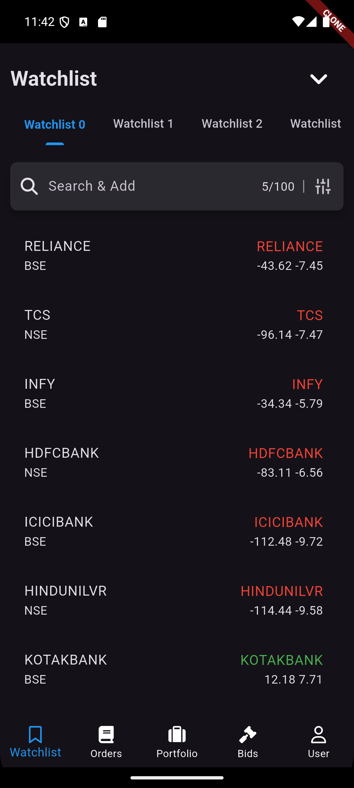
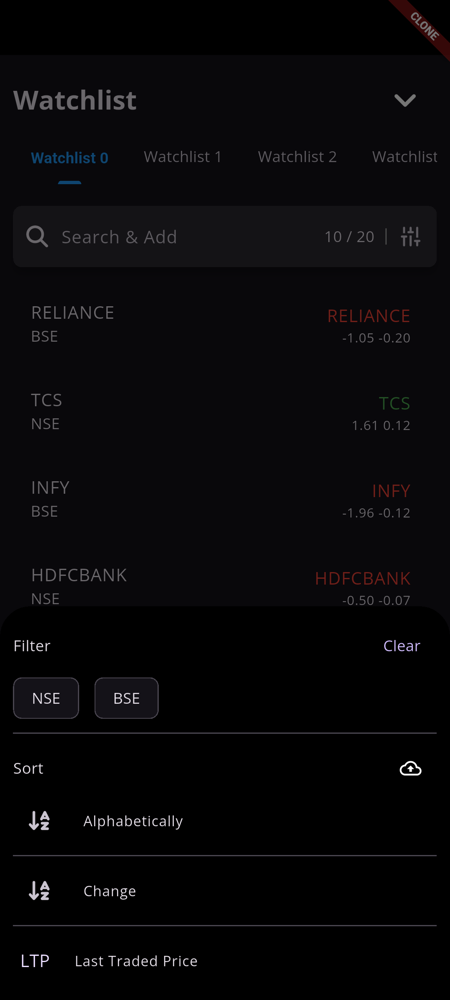
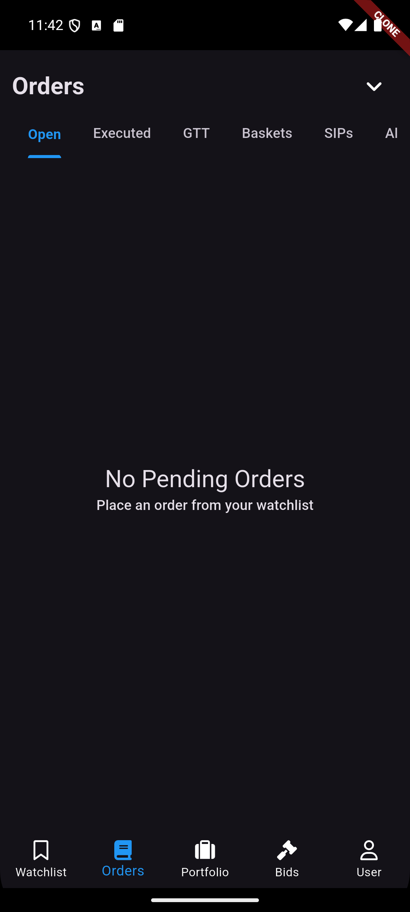
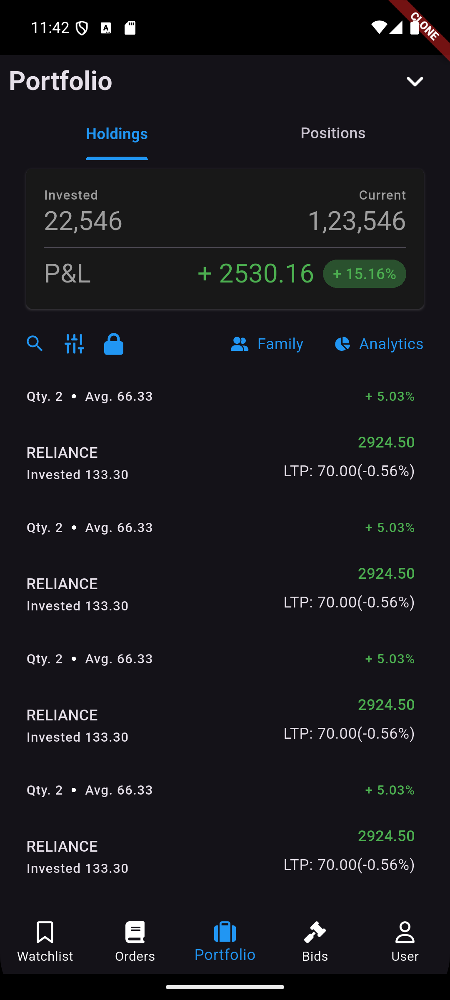
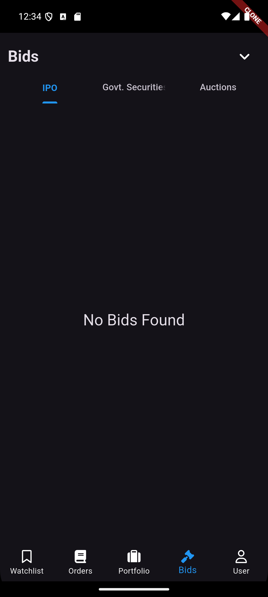
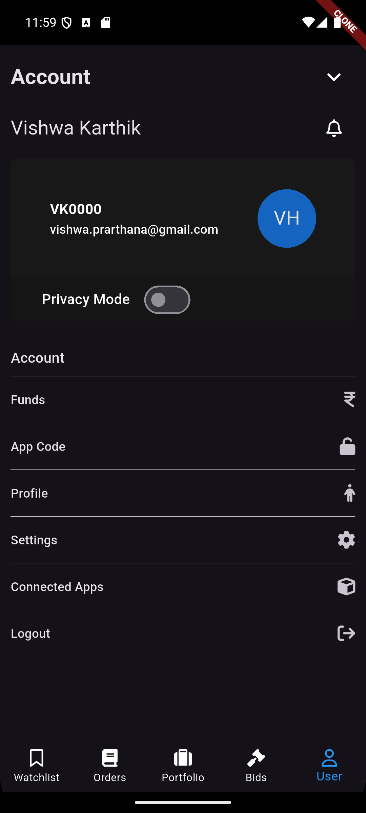
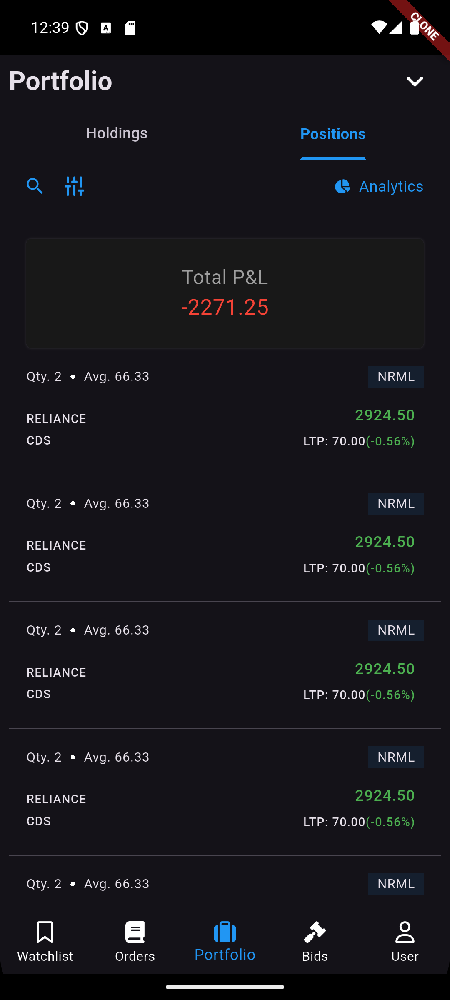
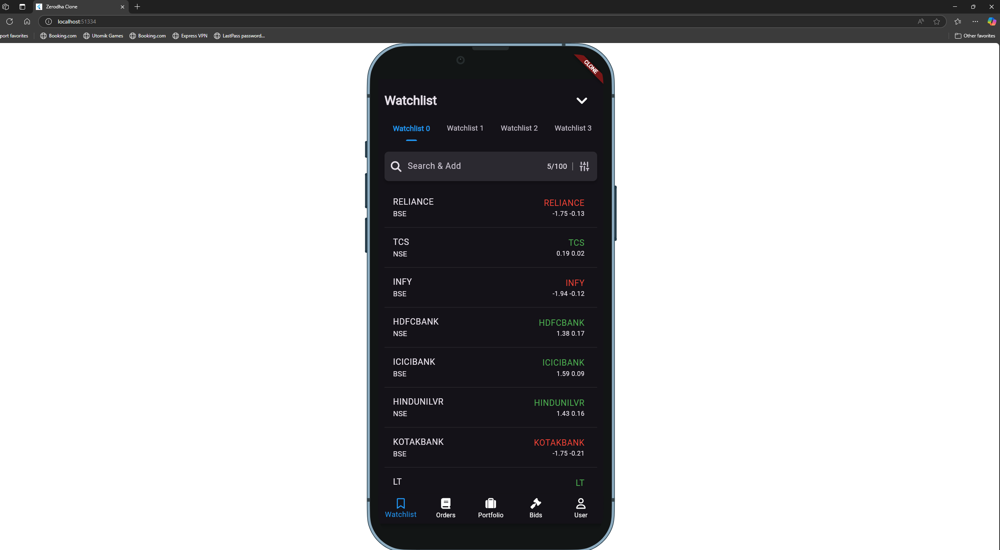

# Zerodha Clone
- This project is just a mock of the **Kite** trading application built using **Flutter** for frontend and **GoLang** for the backend.
- The application is designed to provide real-time mocked stock updates integrating only the **Watchlist Page**.
---

## Demo

### Start Server Locally
- Navigate to the backend directory.
```bash
cd ./server
```
- Run the WebSocket server:
```bash
go run cmd/main.go
```

### Install Apk from Github (Preferred)
 + Simply start the server on localhost and install the apk from [APK](https://github.com/Vishwa-Karthik/zerodha-clone/tags)
 + To keep things simple, I've just hardcoded this entire project to run it on `localhost` via `port:8080`

### Just Run the Project on Edge/Chrome
```bash
flutter run -d chrome
```

## Tech Stack

### 1. **Frontend**: Flutter
- **Framework**: Flutter is used for building a cross-platform mobile application with a responsive and modern UI.
- **State Management**: Riverpod is used for state management to handle asynchronous data streams and UI updates efficiently.
- **Target Platforms** : Small Screen - Mobile Devices

### 2. **Backend**: GoLang
- **WebSocket Server**: A WebSocket server is implemented in GoLang to provide real-time stock updates.
- **Web-Framework** - Favoured gin-gonic framework.
- **Stock Ticker**: Randomly chose 10 different stocks.
- **Ticker Update**: Each second interval the ticker updates with +2/-2 frequency.
- **Socket Connection** - Upgraded the connection to web-socket by Gorilla-Websocket.


## Features Implemented

### 1. **Watchlist Page**
- **Scope** - Due to limited time, I've just integrated `WatchList` screen with 10 stocks coming from API as a way to showcase the implementation.
- **Search Functionality**:
  - I tried leveraging my own fuzzy search package called `Fuzzy_Bolt` from [pub.dev](https://pub.dev/packages/fuzzy_bolt)
- **Real-Time Stock Updates**:
  - Stock data is randomly tweeked every second to mimic the change in stock price.
- **Error Handling**:
  - Displays an error message and a retry button if the WebSocket connection fails.

### 2. **User Interface**
- I've only tried to replicate the basic user-interface without graphs and charts due to limited time.


## How to Run the Project

### 1. Backend
- Navigate to the backend directory.
```bash
cd ./server
```
- Run the WebSocket server:
```bash
go run cmd/main.go
```

### 2. Manual Debug Client 
- Navigate to the client directory.
```bash
cd ./client/zerodha_clone
```

- If you're running this project on emulator then, client runs automatically on emulator's IP address -
```bash
ws://10.0.2.2:8080/stocks
```

- If you're running this project on web then client runs automatically on below address -
```bash
ws://localhost:8080/stocks
```
- Run the WebSocket server:
```bash
flutter run 
```

Note - Alternatively, you may use adb port transfer like below if needed to avoid confusion.
```bash
adb transfer tcp:8080 tcp:8080
```


## Screenshots

<div style="display: flex; justify-content: space-around;">
    
    
</div>

<div style="display: flex; justify-content: space-around; margin-top: 10px;">
    
    
</div>

<div style="display: flex; justify-content: space-around; margin-top: 10px;">
    
    
</div>
<div style="display: flex; justify-content: space-around; margin-top: 10px;">
    
</div>

<div style="display: flex; justify-content: space-around; margin-top: 10px;" >
    

</div>
